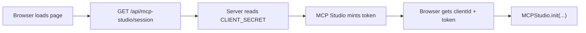

# MCP Studio SDK Sample Apps

Working demo apps showing how to embed **MCP Studio SDK** in a Next.js product. Each one is a complete, runnable integration you can clone, point at your own credentials, and see live.

These contain no MCP Studio internals and no credentials. You supply your own.

## Apps in this repo

| App | Concept | Port |
|-----|---------|------|
| `apps/helpdesk-iq` | Customer support platform where teams build MCP servers from product docs and knowledge bases | 3000 |
| `apps/policy-pilot` | Compliance and legal operations, building MCP servers from policy and regulatory content | 3001 |
| `apps/knowledgecloud-lms` | Enterprise LMS, building course-specific MCP servers for onboarding and training | 3002 |

Ports differ so you can run all three at once and compare configurations.

## Quick start

You need your own credentials. The apps will not render the wizard without them, and the on-screen message tells you exactly what is missing.

**1. Get credentials** from the [MCP Studio SDK portal](https://appatools.com/mcp-studio-sdk/portal). You need both the **Client ID** and the **Client Secret**. The secret is shown in full only when you generate it.

**2. Install and configure:**

```bash
npm install
cd apps/helpdesk-iq
cp .env.example .env.local
```

Edit `.env.local` and paste both values:

```bash
MCP_STUDIO_CLIENT_ID=your_client_id_here
MCP_STUDIO_CLIENT_SECRET=your_client_secret_here
```

**3. Run it** from the repo root:

```bash
npm run dev:helpdesk    # http://localhost:3000
npm run dev:policy      # http://localhost:3001
npm run dev:lms         # http://localhost:3002
```

Each app is configured independently, so repeat step 2 in each app directory you want to run.

## Why both credentials are required

Your **Client ID is public**. It ships to the browser in the embed config, so anyone can read it in your page source. That is expected, and it means the ID alone does not prove an embed session came from you.

Your **Client Secret is not public**. Your backend exchanges it for a short-lived attribution token, and only that token goes to the browser. It expires in 15 minutes and can be spent once.

These samples demonstrate that full flow rather than the shortest thing that renders, because the shortest thing that renders is an unverified session, and an unverified session cannot bill overage.



## What each sample includes

- Next.js 14 App Router fullstack setup
- One API route with mock business data, so the page has real context around the embed
- `src/lib/mcp-studio.ts` — server-side credential reading and token minting
- `src/app/api/mcp-studio/session/route.ts` — the session endpoint your integration needs
- `src/components/McpStudioEmbed.tsx` — the browser half, which never sees the secret
- `src/components/SetupNotice.tsx` — actionable setup screen shown until credentials are present
- A README covering the concept, the customizations chosen, and how credentials flow

## Environment variables

| Variable | Required | Reaches the browser |
|----------|----------|---------------------|
| `MCP_STUDIO_CLIENT_ID` | Yes | Yes, it is public |
| `MCP_STUDIO_CLIENT_SECRET` | Yes | **No** |
| `MCP_STUDIO_BASE_URL` | No | No |
| `NEXT_PUBLIC_MCP_STUDIO_EMBED_URL` | No | Yes |

Do not rename the secret to `NEXT_PUBLIC_MCP_STUDIO_CLIENT_SECRET`. Next.js inlines every `NEXT_PUBLIC_*` value into the JavaScript bundle, which would publish it to every visitor. MCP Studio additionally refuses the token exchange when it arrives from a browser, so that mistake fails loudly instead of leaking quietly.

`.env.local` is gitignored. `.env.example` is the tracked template.

## Troubleshooting

| What you see | Cause | Fix |
|---|---|---|
| "Add your MCP Studio credentials" | One or both values are missing or still the placeholder | Edit `.env.local`, then restart the dev server |
| "MCP Studio rejected these credentials" | The ID and secret do not match a developer account | Copy both again from the portal |
| Setup card persists after editing `.env.local` | Next.js reads env files at startup | Restart the dev server |
| Port already in use | Another app or process holds it | Stop it, or run `next dev -p <port>` |

## Documentation

- [Embed the widget](https://docs.appatools.com/sdk/getting-started/embed)
- [Verify embed sessions](https://docs.appatools.com/sdk/guides/attribution-tokens)
- [Configuration reference](https://docs.appatools.com/sdk/reference/configuration)
- [API reference](https://docs.appatools.com/sdk/reference/api)

## Notes

These demos are UI-first and intentionally lightweight. Replace the mock API data and branding with your own to build a tailored demo.
